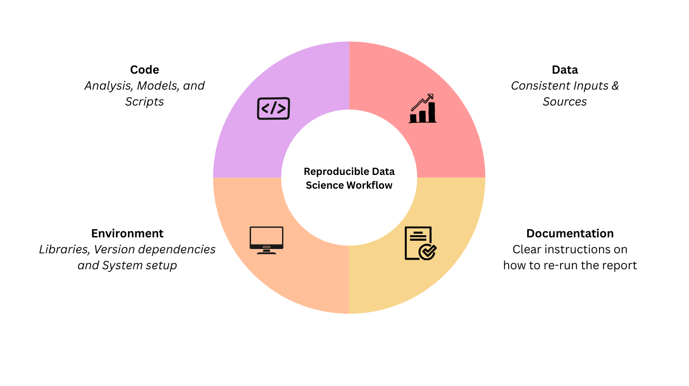

# The ‘It Works on My Machine’ Problem
Have you ever encountered the problem when trying to run a data science report written by a colleague and you run into error after error, and all they say is: “But it runs on my computer!”

If you’ve worked in data science long enough, chances are you’ve ran into this exact problem. One missing package, a mismatched version, or some mysterious dependency issue is all it takes to turn an otherwise simple task into a source of frustration. Suddenly, getting the code to run feels harder than doing the original analysis.

And this isn’t just a small inconvenience, it points to a much bigger reproducibility problem in data science, at a time when the field is placing greater emphasis on transparent, repeatable, and verifiable workflows.

## Why Reproducibility Is Critical in Data Science

So, let's demystify what reproducibility actually means! At its core, reproducibility is about making sure that someone else (including your future self) can run your entire analysis without any ambiguity and get consistent results every time.

Reproducibility is critical in data science because data science results are rarely used in isolation. They are often used to make key decisions, guide policy changes and power machine learning systems. If results cannot be reproduced, it becomes difficult to trust the conclusions drawn from them. Furthermore, in collaborative settings, a reproducible workflow ensures that anyone in the team is able to pick up the project and build on it without having to reverse-engineer the entire process or make assumptions about what steps were taken.

## The reproducible data science workflow

A basic reproducible data science workflow is built around a few core elements:

- **Code**: The Analysis, Models, and Scripts  
- **Data**: Consistent data inputs and sources  
- **Environment**: Libraries, Dependencies, and System setup  
- **Documentation**: Clear instructions on how to re-run the analysis

The good news is that while challenges in reproducibility can feel daunting, they are entirely solvable and the tools to do so are already available.

### Code: The Analysis, Models, and Scripts

Code is rarely static. As analyses evolve, models get refined, and bugs get discovered, your scripts change over time. Without a way to track those changes, it quickly becomes unclear which version of the code produced which results.

This is where version control comes in.

Tools like [Git](https://git-scm.com/) are essential for a reproducible workflow. Git allows you track changes to your code, roll back to earlier versions when needed, and collaborate with others without overwriting each other’s work. Platforms such as [GitHub](https://github.com/) build on this by making it easy to share repositories, review changes, and release versions of your analysis at different points in time.

### Data: Consistent data inputs and sources

Even perfectly written scripts and analysis can lead to inconsistent or misleading results if the data isn’t consistent. If the data from your source changes, or it’s unclear exactly which snapshot was used, results can quickly become unpredictable or impossible to replicate.
That is why versioning your data is just as important as versioning your code. Tools like [Data Version Control](https://dvc.org/) (DVC) let you track changes, roll back when needed, and make sure all your collaborators work with the same inputs.

### Environment: Libraries, Dependencies, and System setup  

One of the most common reasons for the dreaded “it works on my machine” is usually because of a mismatch in package dependencies. Different versions of libraries can not only throw errors when used together, but more concerningly, silently produce different results without any warning.

This is where environment files come in. Tools like environment.yml (with Conda) or requirements.txt (with Pip) files allow you to explicitly specify the package versions and their dependencies used when initially running the analysis. These files create a blueprint that anyone who picks up your project can use to recreate the environment and install the required packages used to run your analysis.

For an even more robust solution, [Docker](https://www.docker.com/) can be used to package your entire runtime environment including the operating system itself. This means that your environment becomes completely portable and you can run the same analysis on any machine. This helps to avoid any specific operating system bugs, and be confident that your results will remain consistent and fully reproducible irrespective of physical hardware.

### Documentation: Clear instructions on how to re-run the analysis

At the core of reproducibility is documentation. No matter how perfect your code, data, or environment may be, reproducibility can fail if no one knows how to bring it all together. At a minimum, every data science project should include a README with clear, step-by-step instructions for reproducing the analysis. This should cover the order to run the scripts in, which files to use as well as any key parameters or settings. Additionally, documentation should evolve alongside the project. As code changes or new data sources are introduced, the README should be updated to reflect those changes.

Effective documentation isn’t just a list of steps, it explains the reasoning behind them. Sharing details about data sources, assumptions, and potential pitfalls makes it simple for anyone, including collaborators or viewers of your report to follow your work without confusion.

## Automating the Workflow

So how do we automate this process? Even with clean code, consistent data, and a well-defined environment file, things can still fall apart if steps are ran manually and out of order.

This is where Makefiles come in. A Makefile is a simple way to define your workflow and the dependencies between each step, allowing you to automate the entire analysis pipeline. For example, you can require that datasets are merged and filtered before running exploratory analysis, and that exploratory results are finalized before fitting any models.

With a single command like `make all`, the full workflow runs in the correct order every time. This not only reduces human error but also makes your analysis much easier to reproduce. In collaborative settings, Makefiles are especially helpful because they clearly document the workflow and remove any assumptions about how the analysis should be run.

## Building trust in Data Science

Reproducibility isn’t about adding extra steps to an already complex process. It is about making sure your data science projects are reliable, shareable, and future-proof. By properly managing your code, data, environment, and documentation, you make it possible for others, including your future self to rerun your analysis without any frustration or guesswork.

Tools like Git and GitHub help track changes, versioned data keeps data inputs consistent and reliable, environment files and Docker eliminate dependency issues, and a clear README ties everything together. Used together, these practices turn “it works on my machine” into “it works on all machines.”

Ultimately, reproducibility fosters trust. It streamlines collaboration, simplifies debugging, and strengthens the credibility of your results which is exactly the standards quality data science aims for.